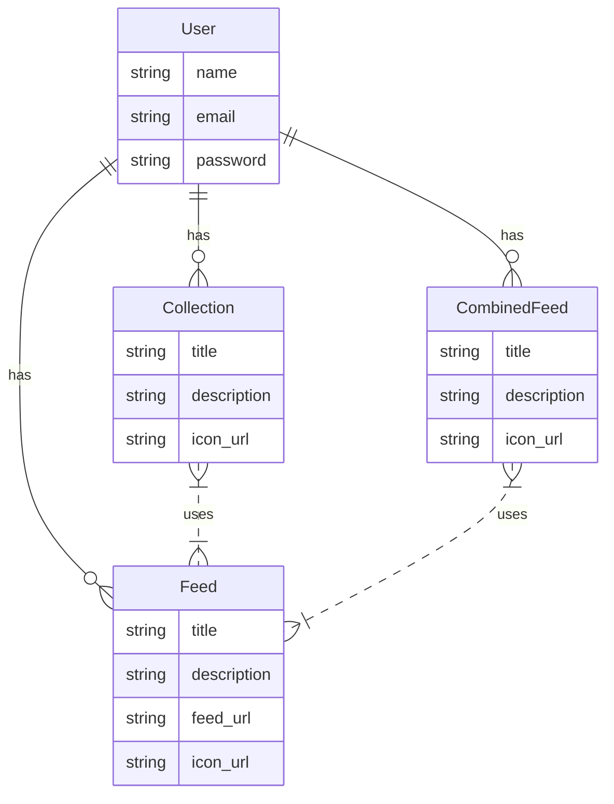

Have you ever desired an RSS feed that combines many RSS feeds into one, or create multiple collections of RSS feeds for various categories? One common option is tod subscribe to an RSS web app service which offers this functionality. But you could also build one from the ground up, if you'd rather save some money and program something fun along the way. Today we'll go over how to create an RSS aggregator app using Elixir and Phoenix. Mainly what we need is an interface to manage the CRUD operations for creating a feed, creating a combined feed that's composed of many other feeds, or creating a common collection of individual feeds. Fortunately for us, Elixir's Phoenix framework provides allows us to quickly prototype this program for us. 

## Getting Started

To get started, you'll first need to install Erlang and Elixir. For this example I'm using Erlang version `25.1.2` and Elixir `1.14.2`. But you can likely run this with relatively similar versions. As for Phoenix, at the time of writing this version `1.7.0` has been promoted to a release candidate, which comes along with a few useful features. So let's go ahead and install that next.

```sh
mix archive.install hex phx_new 1.7.0-rc.0
```

You'll need to configure a database for this application. Phoenix comes pre-configured with Postgres. With Docker and Docker Compose, we can get a database setup to work out of the box with Phoenix's configuration. Of course you'll need to have Docker and Compose already installed on your machine. After installing the two, and supplying your project with the following `docker-compose.yml` file, you will be able to start the application with `mix phx.server`, after running `docker-compose up`, and be ready to program our app.

```yml
version: "3.8" # Requires Docker Engine 19.03.0+
services:
  db:
    image: postgres:12.3
    environment:
      - POSTGRES_PASSWORD=postgres
      - POSTGRES_USER=postgres
      - POSTGRES_DB=rss_dev
    volumes:
      - "./volumes/postgres:/var/lib/postgresql/data"
    ports:
      - "5432:5432"
```

A side note, with that setup it's wise to add `/volumes` to our `.gitignore` file.

### Data Model

The data model for this program is exceptionally straight forward. At it's core the data can be expressed with three models - a `Feed`, `CombinedFeed`, and `Collection`. Additionally we'll want to express ownership of the previous three models with a `User` model. Let's visualize the data model using an Entity Relationship Diagram.



As a side note, we could realistically make `Collection` and `CombinedFeed` polymorphic, distinguishing them uniquely by a `type` property. However, in the interim they will be intentionally separate.

### Generating Our Data Model

Now that we have a working data model let's write some database migrations. Fortunately Phoenix comes with some very useful generators to get us started. These generators will enable us to create our Ecto schema and migrations while being able to bootstrap these entities with companion LiveViews to facilitate CRUD operations. First we will generate our `User` which will authorize all of the CRUD operations for all the models in the entire system, including itself. This is where Phoenix's auth generator comes into play. Not only will this particular generator create all previously mentioned entities, it will also wire up an entire authentication flow for us to leverage using LiveView. In addition to wiring up the flow, it adds logic to maintain a user's session while authenticated with the system.

```sh
mix phx.gen.auth --live Accounts User users
mix deps.get
mix ecto.setup
```

And that's it! We now have a fully functioning authentication flow, CRUD operations, and authorization logic, for a `User`. Phoenix was even kind enough to create a decent UI that will more than suffice for our current needs.

Let's keep the ball rolling and next generate the `Feed`. This time we'll leverage the `phx.gen.live`, which is invoked under the hood when calling the previous generator for auth. Of course the only exception with the live generator is that we are not producing another bootstrapped authentication flow. So we'll again get our Ecto schema, migrations, and LiveViews for its CRUD operations.

```sh
mix phx.gen.live Feeds Feed feeds title:string description:string feed_url:string icon_url:string user_id:references:users
mix ecto.migrate
```

While this approach nearly completes our necessary functionality, we'll need to fill in some missing functionality here. First let's follow the instructions, from the output of the generator, and add the required live routes to our `lib/rss_web/router.ex` so they can be accessable from the browser. These routes must be intentionally declared in the `live_session` declaration which calls `:ensure_authenticated` on mount. This ensures us that our routes will have an authenticated user attached to the LiveView session when any route defined within its block is called. We require this so our feed records can be properly associated to the correct user.

```ex
scope "/", RssWeb do
  pipe_through [:browser, :require_authenticated_user]

  live_session :require_authenticated_user,
    on_mount: [{RssWeb.UserAuth, :ensure_authenticated}] do

    # Place live routes within this block
    live "/feeds", FeedLive.Index, :index
    live "/feeds/new", FeedLive.Index, :new
    live "/feeds/:id/edit", FeedLive.Index, :edit

    live "/feeds/:id", FeedLive.Show, :show
    live "/feeds/:id/show/edit", FeedLive.Show, :edit
  end
end
```

At this point we should be able to run `mix test` to ensure everything that was generated is operating appropriately without failure. Though, what's a passing test suite if we don't break it by adding new functionality? Next we will leverage TDD to finalize the association between `User` and `Feed`.

#### Setup Associations

We must manually complete the association that the generators created within our schemas. Since `User` and `Feed` have a one-to-many relationship, let's update each file to reflect this.

Our `Feed` schema (`/lib/rss/feeds/feed.ex`) will need refine the expression of a `User` association by changing `field :user_id, :id` to `belongs_to :user`, which is effectively the same with the added benefit of allowing Ecto to load the associated user data, if necessary.

```ex
defmodule Rss.Feeds.Feed do
  use Ecto.Schema
  import Ecto.Changeset
  alias Rss.Accounts.User

  schema "feeds" do
    field :description, :string
    field :feed_url, :string
    field :icon_url, :string
    field :title, :string

    belongs_to :user, User

    timestamps()
  end

  @doc false
  def changeset(feed, attrs) do
    feed
    |> cast(attrs, [:title, :description, :feed_url, :icon_url, :user_id])
    |> validate_required([:title, :description, :feed_url, :icon_url, :user_id])
    |> assoc_constraint(:user)
  end
end
```

Notice that our `changeset` function has also been updated. The `cast` and `validate_required` functions respectively had the `:user_id` atom appened to them to signify that the value will be expected when creating records and should be validated. The `assoc_constraint` function call is very important here as it guarantees that a `Feed` entity will only be created if the `User` related to `user_id` exists in the database. Inversely we will need to update our `User` schema (`/lib/rss/accounts/user.ex`) to declare the other end of our one-to-many association.

```ex
schema "users" do
  field :email, :string
  field :password, :string, virtual: true, redact: true
  field :hashed_password, :string, redact: true
  field :confirmed_at, :naive_datetime

  has_many :feeds, Feed

  timestamps()
end
```

At this point we can begin the TDD aspect of this change and run out tests using `mix test` which will result in 6 test failures due to a validation error for an absent `user_id`. To complete the functionality for `Feed` we must tell all our generated LiveViews where they can find the user to associate to a `Feed`. Our previously generated authentication files contain a plug which attaches the session user to the active connection, this makes our life much simpler. Since our LiveViews have access to the connection, we can pass the current user down to them, and its components, so that it's accessible when performing CRUD operations from these LiveViews. First we start by updating the `feed_live/index.html.heex` and `feed_live/show.html.heex` templates to provide our `Feed` components the new property `current_user={@current_user}`. This tells our components to read the `current_user` property from the active connection and make it available to its socket connections.

The live component within the `feed_live/index.html.heex` file will now look like so:
```ex
<.live_component
  module={RssWeb.FeedLive.FormComponent}
  id={@feed.id || :new}
  title={@page_title}
  action={@live_action}
  feed={@feed}
  navigate={~p"/feeds"}
  current_user={@current_user}
/>
```
and similarly the `feed_live/show.html.heex` will look like so:
```ex
<.live_component
  module={RssWeb.FeedLive.FormComponent}
  id={@feed.id}
  title={@page_title}
  action={@live_action}
  feed={@feed}
  navigate={~p"/feeds/#{@feed}"}
  current_user={@current_user}
/>
```

Next, we will need to update `feed_live/form_component.ex` to include the current user's ID in the necessary CRUD operations. Let's write a utility function to handle this. Its will be responsible with taking a `Map` of editable `Feed` properties (title, description, feed URL, and icon URL), and append a `user_id` to it. The resulting `Map` from this utility function will satify the contraints of a `Feed`'s changeset.

```ex
defp params_with_user(feed_params, user), do: Map.put(feed_params, "user_id", user.id)
```

The operations for saving a new or existing feed is encapsulated within the function `save_feed/3`. This function accepts a socket context, saving action, and the parameters which we will use to persist the feed. There are two signatures for this function, which each pattern match the possible actions to initiate the respective persistence operation (create or update). This function is solely called from a `save` event, which is broadcasted from our, feed's live component. The generated version of this function looks like so.

```ex
def handle_event("save", %{"feed" => feed_params}, socket) do
  save_feed(socket, socket.assigns.action, feed_params)
end
```

Since this function handles both cases of persisting a feed, it allows us to encapsulate the new logic for passing the user ID from our session to the input for persistence operations. That results in the following version of our `save` event handler.

```ex
def handle_event("save", %{"feed" => feed_params}, socket) do
  save_feed(
    socket,
    socket.assigns.action,
    params_with_user(feed_params, socket.assigns.current_user)
  )
end
```

We've now wrapped up our `User` and `Feed` associations and should be able to run `mix test` again to produce a passing test suite. However, as it stands our codebase has a major data integrity issue. The way our current `Feed` repo is configured allows any user to operate on an feed record, regardless of ownership. Next our task is to lock down all feed operations to ensure only the owner of a feed can operate on the database record.

### XML Writer

The major facet of this application is the ability to write XML so that we can construct new feeds. There's a nice package out there called elixir-rss that will suit our needs when it comes to writing XML for channels, items, and feeds based on the [RSS 2.0 RFC](https://www.rfc-editor.org/rfc/rfc5005#appendix-B). However, this package hasn't been updated in quite some time and has a few unmerged, and very useful contributions (specifically this [PR](https://github.com/BennyHallett/elixir-rss/pull/14)). Since the package has very few lines of code we will go ahead and absorb it into our code base.

```ex
defmodule Rss.XML.Writer do
  @moduledoc """
  This module is responsible for building the XML of combined RSS feeds. The source code was
  taken from elixir-rss, specifically this branch: https://github.com/BennyHallett/elixir-rss/pull/14
  """
  @spec feed(String.t(), [String.t]) :: String.t()
  def feed(channel, items) do
    """
    <?xml version="1.0" encoding="utf-8"?>
    <rss version="2.0">
    <channel>
    #{channel}#{Enum.join(items, "")}</channel>
    </rss>
    """
  end

  @spec channel(String.t(), String.t(), String.t(), String.t(), String.t()) :: String.t()
  def channel(title, link, desc, date, lang) do
    """
      #{element(:title, title)}
      #{element(:link, link)}
      #{element(:description, desc)}
      #{element(:lastBuildDate, date)}
      #{element(:language, lang)}
    """
  end

  @spec item(String.t(), String.t(), String.t(), String.t(), String.t()) :: String.t()
  def item(title, desc, pub_date, link, guid) do
    """
    <item>
      #{element(:title, title)}
      #{element(:description, desc)}
      #{element(:pubDate, pub_date)}
      #{element(:link, link)}
      #{element(:guid, guid)}
    </item>
    """
  end

  defp element(tag, text) do
    text_chars = to_charlist(text)
    :xmerl.export_simple_element({tag, [text_chars]}, :xmerl_xml)
  end
end
```